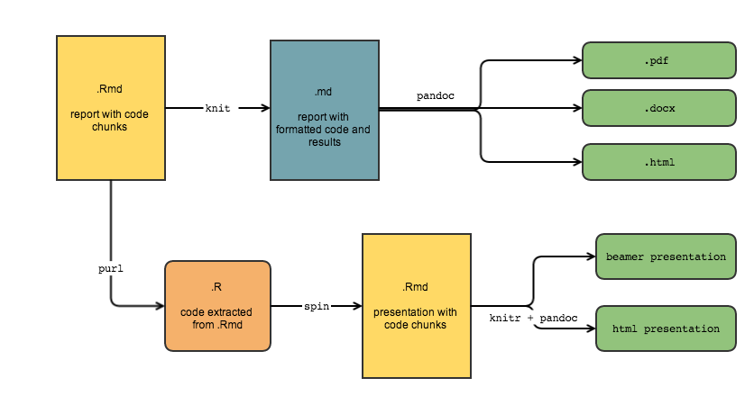

# 学术幻灯片制作
## 相关介绍
### 相关介绍

* Beamer

      Beamer是latex上用来制作演示文档的一个套件。

* markdown
  
      Markdown是一种轻量级的标记性语言。
      
\vspace{12pt}
  
R Markdown + Beamer $\Longrightarrow$ Perfect Academic Presentation!

\vspace{12pt}

* 参考资料

    1. [Pandoc Markdown](http://rmarkdown.rstudio.com/authoring_pandoc_markdown.html)
    2. [Presentations with Beamer Overview](http://rmarkdown.rstudio.com/beamer_presentation_format.html)
    3. [Chunk options and package options](http://yihui.name/knitr/options/)
    4. [Moving from Beamer to R Markdown](http://rmarkdown.rstudio.com/articles_beamer.html)


## 内部原理
### 内部原理

* kniter+ pandoc


## 环境安装
### 环境安装

1. 安装R语言

    [Download R](https://www.r-project.org/) 

2. 安装RStudio  
    
    [Download RStudio](https://www.rstudio.com/)

3. 安装Texlive

    [TeX Live ISO image](http://tug.org/texlive/acquire-iso.html)
    
# RMarkdown语法

## 文档头定义
### 文档头定义

```
title: R Markdown + Beamer = Perfect Academic Presentation
subtitle:  基于RMarkdown快速制作学术幻灯片
author: Jiangyong Wei
date: '`r Sys.Date()`'
fontsize: 10pt
output: 
  beamer_presentation:
    keep_tex: true
    slide_level: 3
    highlight: tango
    pandoc_args: "--latex-engine=xelatex"
    includes:
      in_header: ./texf/header.tex
      before_body: ./texf/prefix.tex
      after_body: ./texf/suffix.tex
    template: ./texf/default_beamer.tex

```

## 多级标题
### 多级标题

`#`   $\Rightarrow$    一级标题section

\vspace{12pt}

`##`  $\Rightarrow$    二级标题subsection

\vspace{12pt}

`###` $\Rightarrow$    三级标题Frame

## 字体
### 字体

`*字体*`   $\Rightarrow$  *字体*

\vspace{12pt}

`**字体**` $\Rightarrow$  **字体**

\vspace{12pt}

`\textcolor{texpurple}{字体}` $\Rightarrow$ \textcolor{texpurple}{字体}

## 列表
### 有序列表

```{}
1.  one
2.  two
3.  three
```

1.  one
2.  two
3.  three

###无序列表

```{}
* fruits
    + apples
        - macintosh
        - red delicious
    + pears
    + peaches
* vegetables
    + broccoli
    + chard
```

* fruits
    + apples
        - macintosh
        - red delicious
    + pears
    + peaches
* vegetables
    + broccoli
    + chard
    
## 数学公式
### 数学公式

* 行内公式 `$`

`$\bf ABCDEFG$` $\Rightarrow$   $\bf ABCDEFG$

`$\rm ABCDEFG$` $\Rightarrow$   $\rm ABCDEFG$

`$\cal ABCDEFG$` $\Rightarrow$  $\cal ABCDEFG$

* 行间公式 `$$`

`$$\begin{aligned} I(X;Y)& = H(X)-H(X|Y)\\
&= H(Y)-H(Y|X)\end{aligned}$$`

$$\begin{aligned} I(X;Y)& = H(X)-H(X|Y)\\
&= H(Y)-H(Y|X)\end{aligned}$$

## 分栏
### 分栏

\begin{columns}[c] % the "c" option specifies center vertical alignment
\column{.5\textwidth} % column designated by a command
Contents of the first column
\column{.5\textwidth}
Contents of the second column
\end{columns}

## Block
### Block

* block

\begin{block}{勾股定理}
  
        直角三角形的斜边的平方等于两直角边的平方和。
可以用符号语言表述为：设直角三角形ABC，其中$\angle C=90^\circ$则有

\begin{equation} AB^2=BC^2+AC^2 \end{equation}

\end{block}

* problock

\begin{problock}{勾股定理}
  
        直角三角形的斜边的平方等于两直角边的平方和。
可以用符号语言表述为：设直角三角形ABC，其中$\angle C=90^\circ$则有

\begin{equation} AB^2=BC^2+AC^2 \end{equation}

\end{problock}

* alertblock ...
* exampleblock ...

## 代码
### 代码

```r
library(knitr)
library(rmarkdown)
file <- list.files(pattern='.Rmd')
rmarkdown::render(file)
```

##其它
###其它

* 表格
* 图片
* 链接
* 引用
...


# Latex设置
## 模板设置和中文支持
### 模板设置和中文支持

* 模板设置

```
    includes:
      in_header: ./texf/header.tex
      before_body: ./texf/prefix.tex
      after_body: ./texf/suffix.tex
    template: ./texf/default_beamer.tex
```
* 中文支持

```{}
\usepackage{xeCJK}
\setCJKmainfont{Microsoft YaHei}
\setCJKsansfont{SimHei}
\setCJKmonofont{FangSong}
```

其它设置请参考in_header、before_body、after_body、template的tex文件定义。